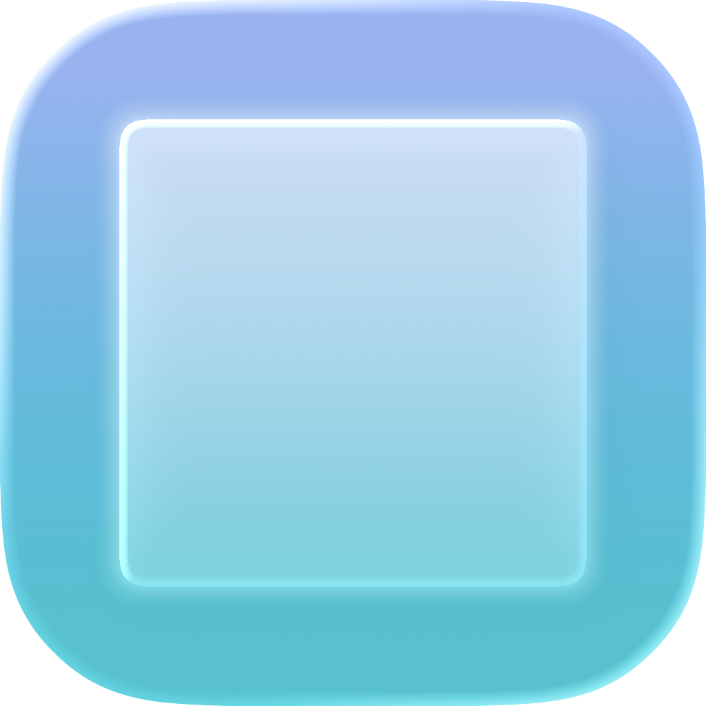

<p align="center">
  
</p>

<h1 align="center">Blur Browser</h1>

<p align="center">
  A calmer, safer web browser for macOS.<br />
  Built on WebKit. Free and open source — forever.
</p>

<p align="center">
  <a href="https://github.com/sponsors/EngOmarElsayed">
    
  </a>
  
  
</p>

---

## What is Blur?

Blur is a native macOS browser that protects you from adult content by **blurring images and videos automatically** as you browse. Under the hood it's WebKit — the same engine as Safari — so sites load fast and work right. On top of that, we've built a calmer UI, seven hand-crafted themes, and a growing set of tools to shield you from what you'd rather not see.

**Core ideas:**

- 🫧 **Blur adult content** — images *and* videos, detected and softened on the fly.
- 🚫 **Website blocking** (coming soon) — block domains at the browser level. No extensions, no workarounds.
- 📚 **Vertical sidebar** — tabs stacked on the left, not crammed along the top.
- ⌨️ **Keyboard-first** — press `⌘ + /` anywhere to see the full shortcut list.
- 🎨 **Seven themes** — from airy Periwinkle to inky Midnight.
- 🔍 **Quick Search** (`⌘K`) — find open tabs, history, and the web from one calm overlay.
- 🧘 **Zen mode** — hide the chrome, keep only the page.
- 😅 **Funny error messages** — because a stack trace is never what you needed.
- 🛡️ **Private & secure** — no tracking, no telemetry. Your history stays on your Mac.
- ⚡ **WebKit engine** — fast to load, gentle on your battery.

## Requirements

- macOS 14 (Sonoma) or later
- Xcode 16+

## Getting Started

```bash
# Open in Xcode
open Blur-Browser.xcodeproj

# Or build from the command line
xcodebuild -project Blur-Browser.xcodeproj -scheme Browse -configuration Debug build
```

## Project Layout

```
Browse/           # The macOS app (AppKit + SwiftUI hybrid)
  App/            # Entry point, AppDelegate, menu bar
  Window/         # Window, window controller, root layout
  Sidebar/        # SwiftUI tab list (left side)
  Toolbar/        # Address bar with nav buttons
  WebContent/     # WKWebView controller + coordinator
  Search/         # Quick Search overlay + Find in Page
  History/        # SwiftData store + history panel
  Tab/            # Tab model, tab manager, session persistence
  Theme/          # 7-theme system + theme store
  Shared/         # Design tokens, constants, shortcuts
  Resources/      # Assets, Info.plist, entitlements

Website/          # Next.js marketing site (blurbrowser.app)
```

## Architecture Highlights

- **AppKit hosts, SwiftUI embeds** — the window, toolbar, and WKWebView are AppKit-owned. SwiftUI views (sidebar, history panel, Quick Search) are embedded via `NSHostingController`.
- **Manual frame layout** for the root view controller — avoids `NSSplitViewController` + `NSHostingController` layout cycle crashes with `fullSizeContentView`.
- **One `WKWebView` per tab** — stored in the `BrowserTab` model; only the active tab's web view is in the view hierarchy.
- **`TabManager` is the source of truth** — all tab mutations go through it.
- **`@Observable` everywhere** — no `ObservableObject`, no `@StateObject`.
- **No third-party dependencies** — only Apple frameworks (WebKit, SwiftUI, AppKit, SwiftData).

## Keyboard Shortcuts

| Shortcut | Action |
|---|---|
| `⌘ + /` | Show all shortcuts |
| `⌘ + T` | New Tab (opens Quick Search) |
| `⌘ + K` | Quick Search (current tab) |
| `⌘ + W` | Close Tab |
| `⌘ + L` | Focus & select URL bar |
| `⌘ + Shift + C` | Copy current URL |
| `⌘ + F` | Find in Page |
| `⌘ + G` / `⌘ + Shift + G` | Find Next / Previous |
| `⌘ + \` | Toggle Sidebar |
| `⌘ + Y` | Toggle History Panel |
| `⌘ + [` / `⌘ + ]` | Back / Forward |
| `⌘ + R` / `⌘ + Shift + R` | Reload / Hard Reload |
| `⌘ + 1–9` | Switch to Tab 1–9 |
| `⌘ + Shift + ]` / `⌘ + Shift + [` | Next / Previous Tab |

## Website

The marketing site lives in [`Website/`](Website/) — a Next.js 15 app with the same 7-theme palette as the browser.

```bash
cd Website
npm install
cp .env.local.example .env.local   # add your Web3Forms key for the contact form
npm run dev
```

## Contributing

Issues and pull requests are welcome. For anything non-trivial, please open an issue first so we can discuss the approach.

## License

[MIT](LICENSE) © 2026 Omar Elsayed

---

## 💖 Sponsor

Blur is free and will always be free. No ads, no trackers, no paid tiers hidden behind features.

If Blur has made your browsing a little calmer, consider sponsoring the project. Every contribution — no matter how small — helps keep it independent, open, and moving forward.

<p align="center">
  <a href="https://github.com/sponsors/EngOmarElsayed">
    
  </a>
</p>

<p align="center">
  <a href="https://github.com/sponsors/EngOmarElsayed"><strong>github.com/sponsors/EngOmarElsayed</strong></a>
</p>

Thank you — you're the reason this project exists. 🫶
